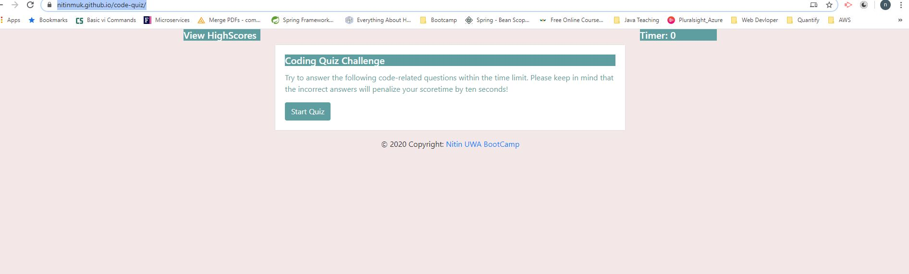
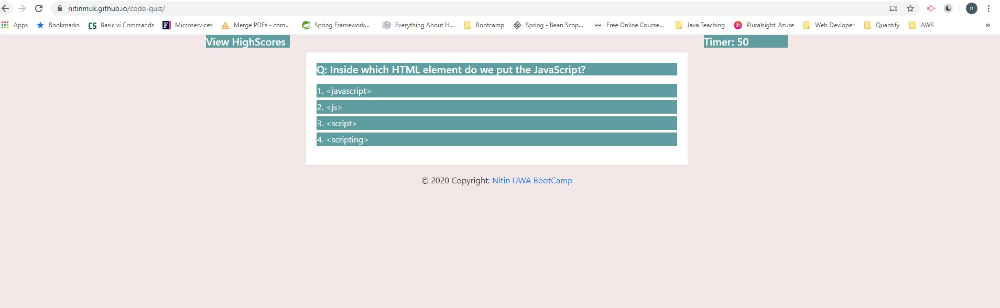
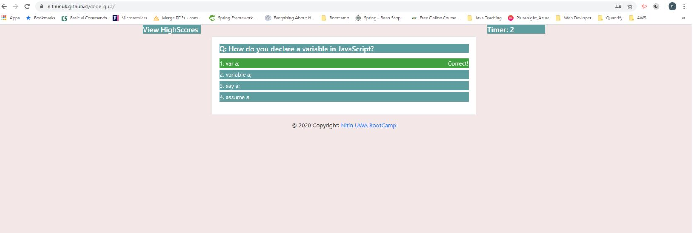
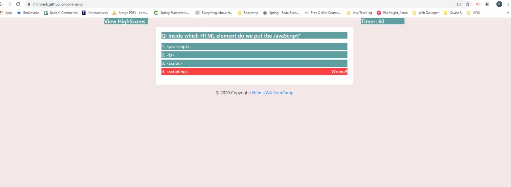
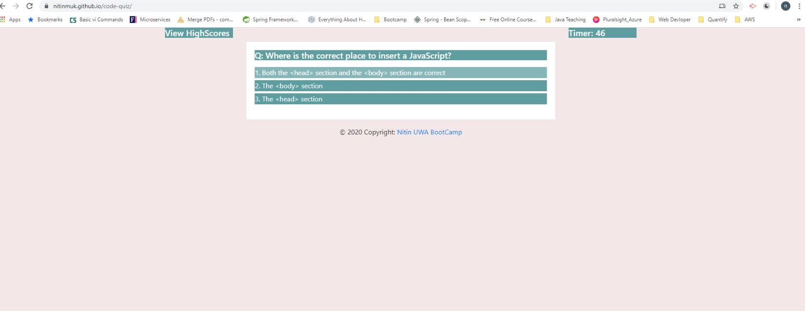
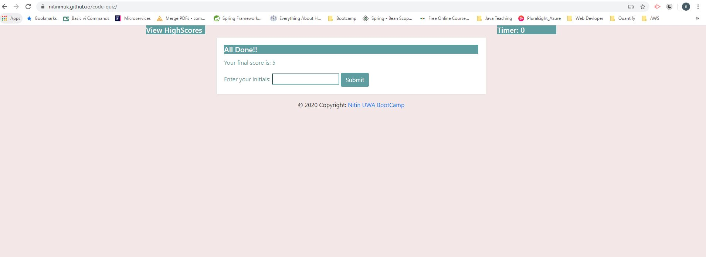
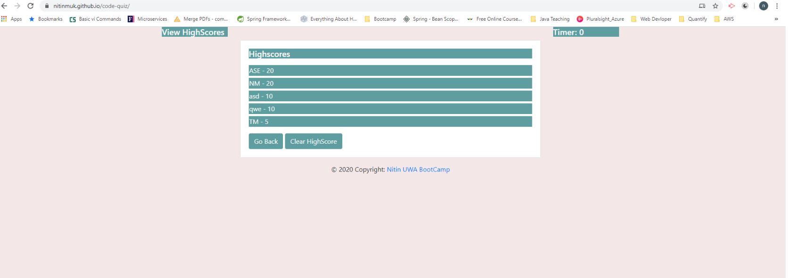
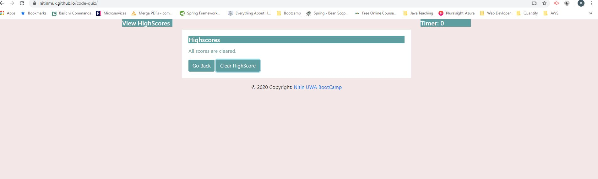
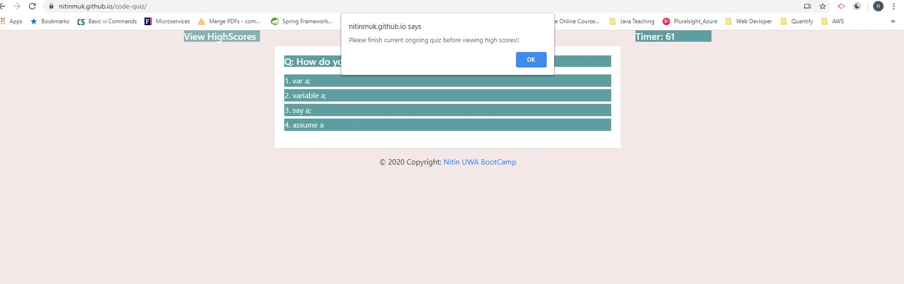

# Description:
It is a timed code quiz application with multiple-choice questions on JavaScript fundamentals that stores high scores. This app will run in the browser and feature dynamically updated HTML and CSS powered by JavaScript code. It will also feature a clean and polished user interface and be responsive, ensuring that it adapts to multiple screen sizes.

# Screenshots of built code quiz application:

# Deployed application URL(link):
https://nitinmuk.github.io/code-quiz/
